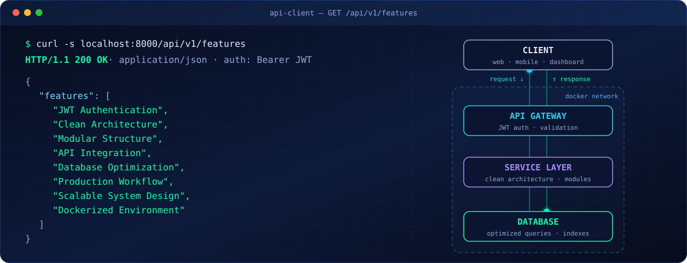

<h1 align="center">Ahmad Yogi Kulumul Ilham</h1>

<p align="center">
  
</p>

# ░▒▓█ 🚀 SYSTEM PROFILE █▓▒░

<p align="center">
  
</p>

---

# ░▒▓█ 🧠 ABOUT ME █▓▒░

<p align="center">
  
</p>

---

# ░▒▓█ 💻 CORE EXPERTISE █▓▒░

<p align="center">
  
</p>

---

# ░▒▓█ ⚡ TECH STACK █▓▒░

<p align="center">

</p>

---

# ░▒▓█ 📊 GITHUB ANALYTICS █▓▒░

<p align="center">


</p>

<p align="center">

</p>

<!--<p align="center">

</p>-->

---

# ░▒▓█ 🔥 ACTIVE PROJECTS █▓▒░

<p align="center">
  
</p>

---

# ░▒▓█ 🌐 BACKEND API DEVELOPMENT █▓▒░

<p align="center">
  
</p>

---

# ░▒▓█ 💼 FREELANCE STATUS █▓▒░

<p align="center">
  
</p>

---

# ░▒▓█ 📡 CONNECT WITH ME █▓▒░

<p align="center">

<a href="https://linkedin.com/in/ahmad-yogi">

</a>

<a href="mailto:yogiilham003@gmail.com">

</a>

<a href="https://t.me/ayki12">

</a>

</p>

---

# ░▒▓█ 👾 CONTRIBUTION GRAPH █▓▒░

<p align="center">
<picture>
  <source media="(prefers-color-scheme: dark)" srcset="https://raw.githubusercontent.com/yogicodee/yogicodee/output/pacman-contribution-graph-dark.svg">
  <source media="(prefers-color-scheme: light)" srcset="https://raw.githubusercontent.com/yogicodee/yogicodee/output/pacman-contribution-graph.svg">
  
</picture>
</p>

---

# ░▒▓█ 🎯 MOTTO █▓▒░

```txt
"Building scalable systems,
solving real problems,
and continuously learning
through technology."
```

---

<p align="center">

</p>

<p align="center">

</p>
